<h1 align="center">Graph Construction Gallery</h1>

<p align="center">
  <strong>A visual encyclopedia of 58 graph construction algorithms, all demonstrated on the same point layout.</strong>
</p>

<p align="center">
  <a href="#-quick-start">Quick Start</a> •
  <a href="#-the-canonical-point-layout">Point Layout</a> •
  <a href="#-gallery">Gallery</a> •
  <a href="#-api-usage">API</a> •
  <a href="#-contributing">Contributing</a>
</p>

<p align="center">
  
  
  
</p>

---

## What Is This?

This repository is a **comprehensive, visual reference** for graph construction algorithms. Every algorithm builds a graph from the **same set of 30 points** arranged in two clusters (a small cluster of 10 and a large cluster of 20), so you can directly compare how different methods connect the same data.

Whether you're studying **spectral clustering**, building **approximate nearest neighbor** indices, designing **mesh generation** pipelines, or just curious about graph theory — this gallery gives you side-by-side intuition.

---

## Quick Start

```bash
# Clone the repo
git clone https://github.com/FPWRasmussen/graph-construction-gallery.git
cd graph-construction-gallery

# Install dependencies
pip install -e ".[dev]"

# Generate the canonical point layout
python scripts/generate_points.py

# Generate ALL example images (saves to assets/examples/)
python scripts/generate_all_examples.py
```

### Dependencies

```
numpy >= 1.24
scipy >= 1.11
scikit-learn >= 1.3
networkx >= 3.1
matplotlib >= 3.8
shapely >= 2.0
```

---

## The Canonical Point Layout

Every graph in this gallery is constructed on **the same 30 points**: two Gaussian clusters with a clear separation.

- **Cluster A (small):** 10 points, centered at (-2.0, 0.0), σ = 0.5
- **Cluster B (large):** 20 points, centered at (2.0, 0.0), σ = 0.8
- **Random seed:** 42 (fully reproducible)

<p align="center">
  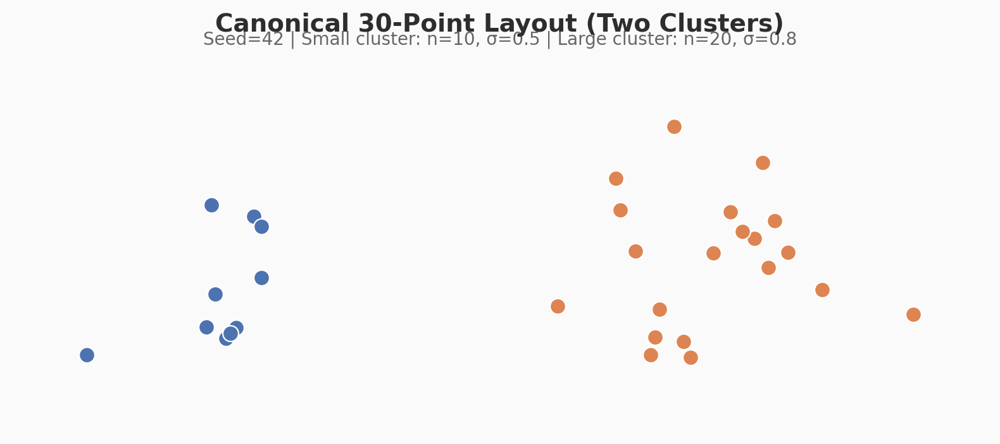
</p>

> **Note:** Lattice/structured graphs (Section 5) use their own canonical node positions since their topology *defines* the layout. They are shown with ~30 nodes for visual consistency.

> **Note:** Visibility graphs (Section 9) interpret the x-coordinates of the points as a time series, using the y-coordinates as values.

---

<!-- GALLERY_START -->

## Gallery

### 1 · Proximity & Distance-Based Graphs

Graphs built by connecting points based on spatial distance or neighbor relationships.

<table>
  <tr>
    <td align="center" valign="top" width="33%">
      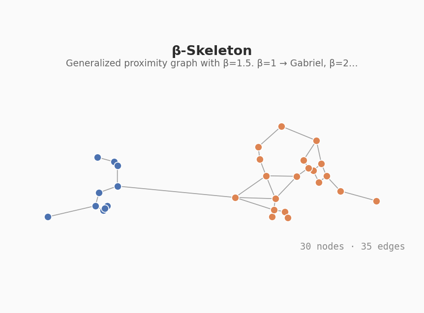<br/>
      <strong>1.1 β-Skeleton</strong><br/>
      <sub>Generalized proximity graph with β=1.5. β=1 → Gabriel, β=2 → RNG.</sub>
    </td>
    <td align="center" valign="top" width="33%">
      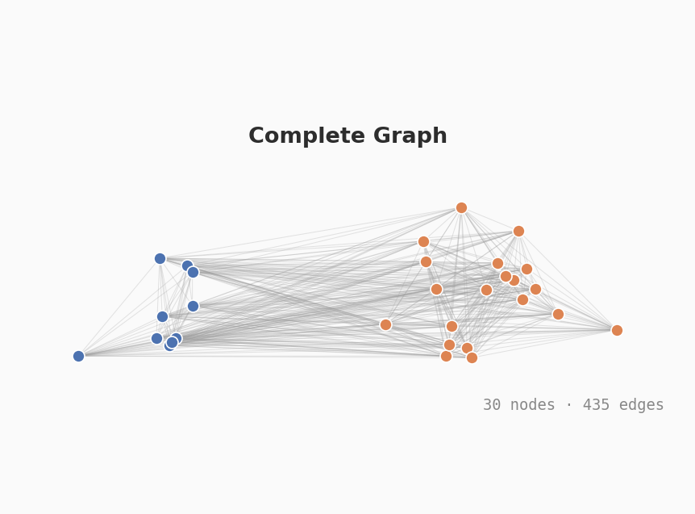<br/>
      <strong>1.2 Complete Graph</strong><br/>
      <sub>Every node connected to every other node. O(n²) edges.</sub>
    </td>
    <td align="center" valign="top" width="33%">
      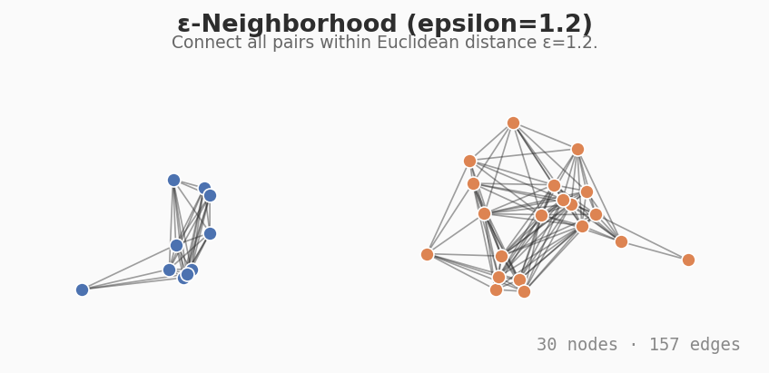<br/>
      <strong>1.3 ε-Neighborhood</strong><br/>
      <sub>Connect all pairs within Euclidean distance ε=1.2.</sub>
    </td>
  </tr>
  <tr>
    <td align="center" valign="top" width="33%">
      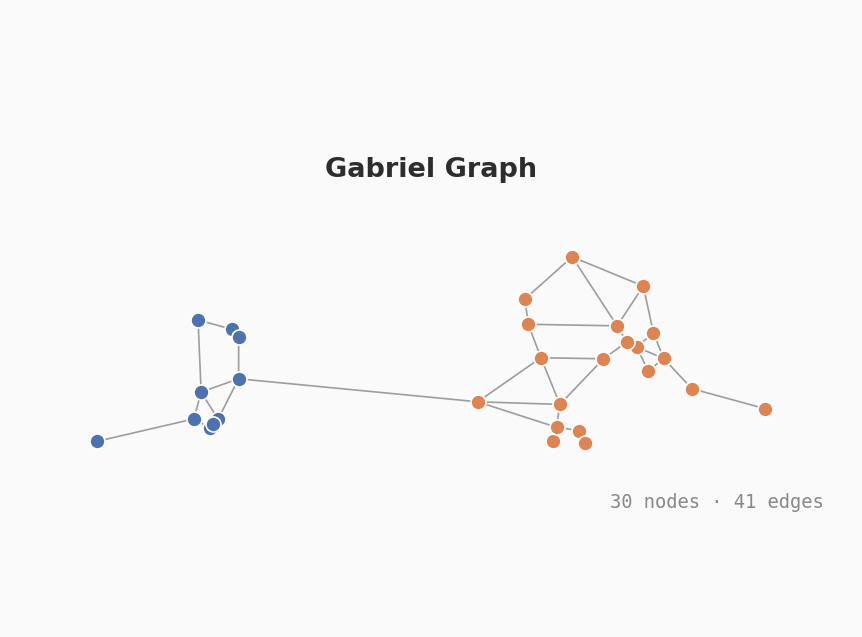<br/>
      <strong>1.4 Gabriel Graph</strong><br/>
      <sub>Connect if no other point lies inside the diametral disk. Equivalent to β-skeleton with β=1.</sub>
    </td>
    <td align="center" valign="top" width="33%">
      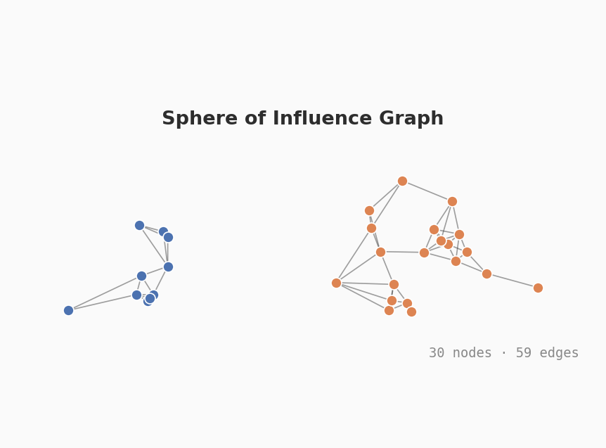<br/>
      <strong>1.5 Sphere of Influence Graph</strong><br/>
      <sub>Each point's radius = nearest-neighbor distance. Connect if spheres overlap.</sub>
    </td>
    <td align="center" valign="top" width="33%">
      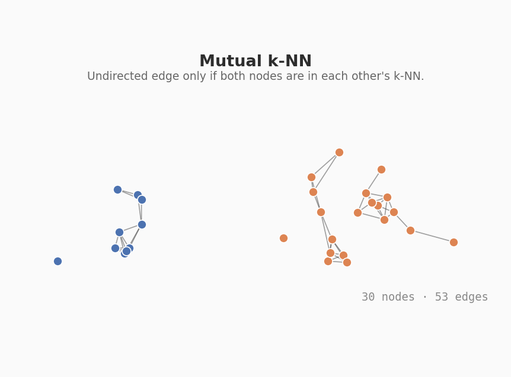<br/>
      <strong>1.6 Mutual k-NN</strong><br/>
      <sub>Undirected edge only if both nodes are in each other's k-NN.</sub>
    </td>
  </tr>
  <tr>
    <td align="center" valign="top" width="33%">
      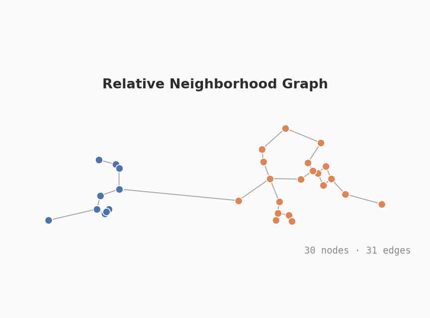<br/>
      <strong>1.7 Relative Neighborhood Graph</strong><br/>
      <sub>Connect if no third point is closer to both endpoints. Equivalent to β-skeleton with β=2.</sub>
    </td>
    <td align="center" valign="top" width="33%">
      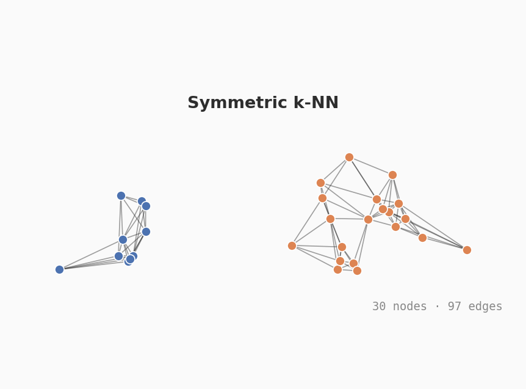<br/>
      <strong>1.8 Symmetric k-NN</strong><br/>
      <sub>Undirected edge if either node is in the other's k-NN (union).</sub>
    </td>
    <td align="center" valign="top" width="33%">
      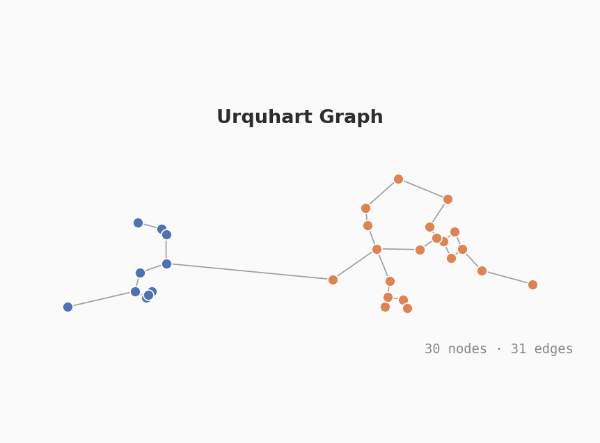<br/>
      <strong>1.9 Urquhart Graph</strong><br/>
      <sub>Delaunay triangulation minus the longest edge of each triangle. Approximates the RNG.</sub>
    </td>
  </tr>
</table>

---

### 2 · Triangulation-Based Graphs

Graphs derived from triangulations and Voronoi structures.

<table>
  <tr>
    <td align="center" valign="top" width="33%">
      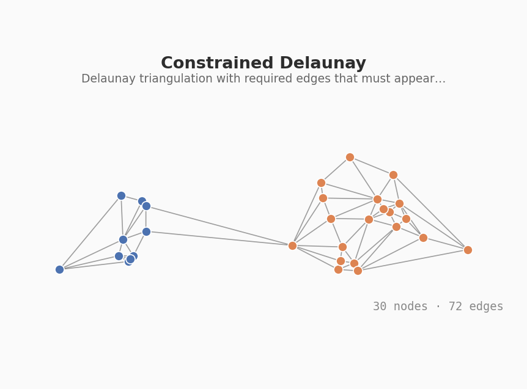<br/>
      <strong>2.1 Constrained Delaunay</strong><br/>
      <sub>Delaunay triangulation with required edges that must appear. Uses Shewchuk's Triangle when available.</sub>
    </td>
    <td align="center" valign="top" width="33%">
      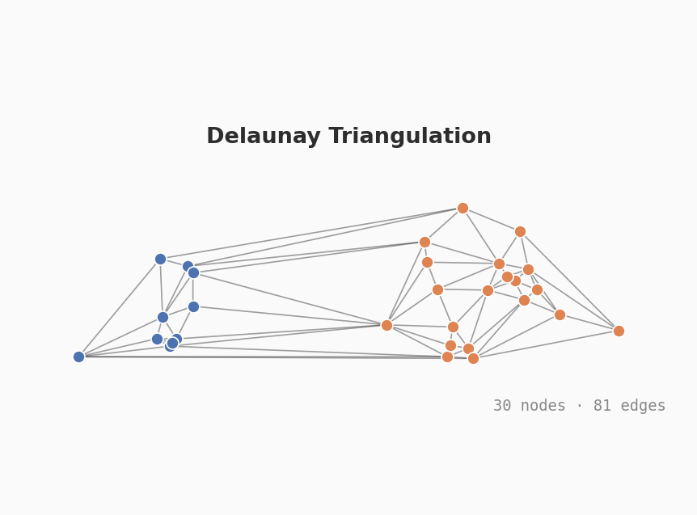<br/>
      <strong>2.2 Delaunay Triangulation</strong><br/>
      <sub>Triangulation maximizing the minimum angle. Dual of the Voronoi diagram.</sub>
    </td>
    <td></td>
  </tr>
</table>

---

### 3 · Spanning Tree-Based Graphs

Minimal or constrained trees connecting all nodes.

<table>
  <tr>
    <td align="center" valign="top" width="33%">
      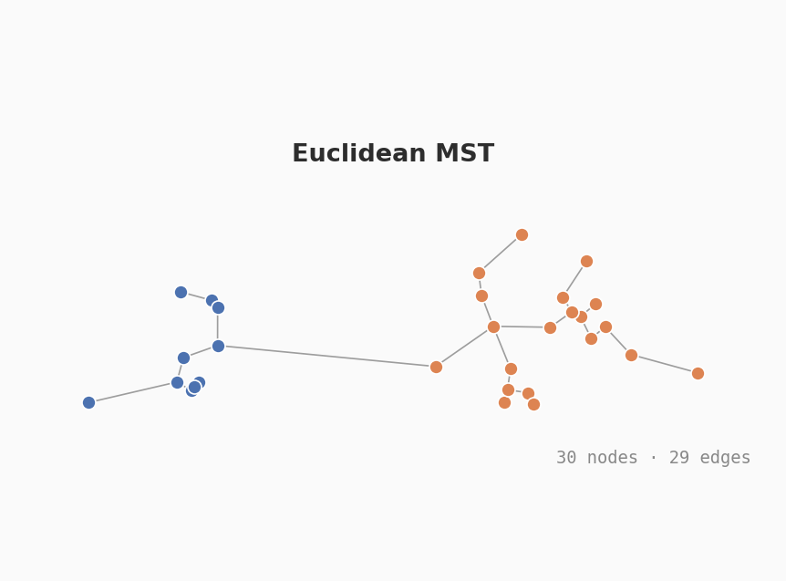<br/>
      <strong>3.1 Euclidean MST</strong><br/>
      <sub>Minimum spanning tree via Delaunay triangulation. O(n log n) instead of O(n²).</sub>
    </td>
    <td align="center" valign="top" width="33%">
      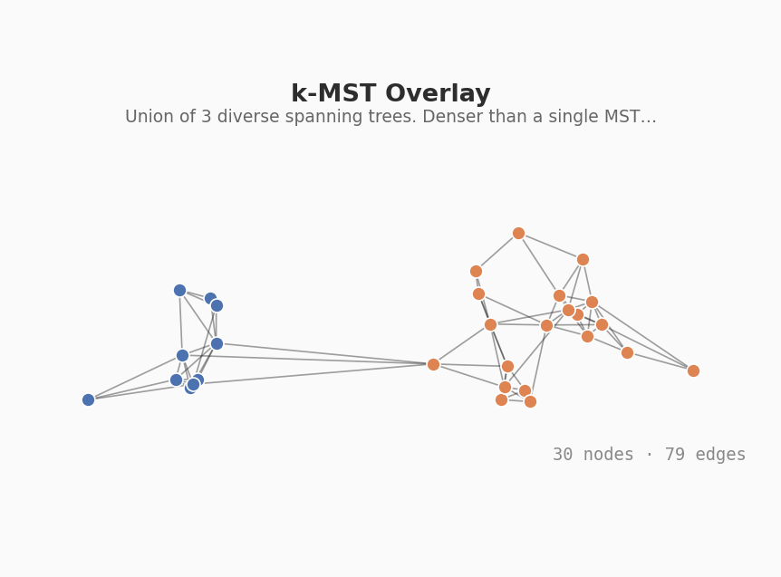<br/>
      <strong>3.2 k-MST Overlay</strong><br/>
      <sub>Union of 3 diverse spanning trees. Denser than a single MST but much sparser than complete.</sub>
    </td>
    <td align="center" valign="top" width="33%">
      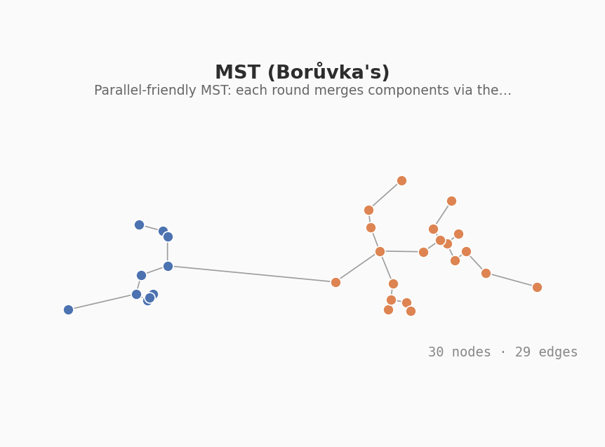<br/>
      <strong>3.3 MST (Borůvka's)</strong><br/>
      <sub>Parallel-friendly MST: each round merges components via their cheapest outgoing edge. O(log n) rounds.</sub>
    </td>
  </tr>
  <tr>
    <td align="center" valign="top" width="33%">
      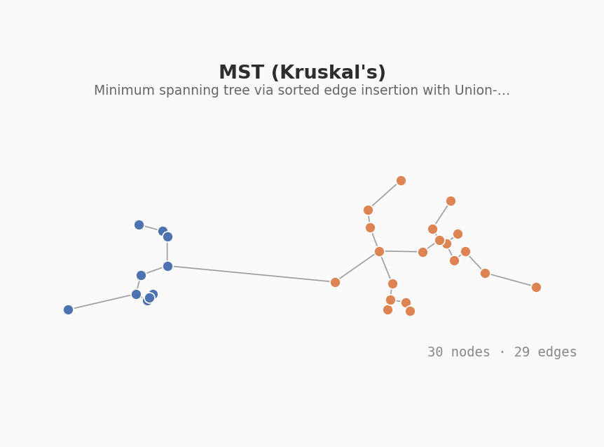<br/>
      <strong>3.4 MST (Kruskal's)</strong><br/>
      <sub>Minimum spanning tree via sorted edge insertion with Union-Find cycle detection.</sub>
    </td>
    <td align="center" valign="top" width="33%">
      <br/>
      <strong>3.5 MST (Prim's)</strong><br/>
      <sub>Minimum spanning tree grown from a start vertex. Greedy vertex-centric approach with a priority queue.</sub>
    </td>
    <td align="center" valign="top" width="33%">
      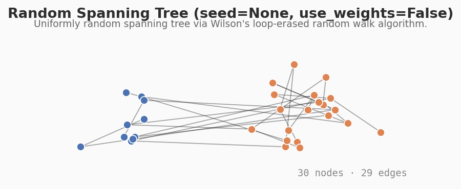<br/>
      <strong>3.6 Random Spanning Tree</strong><br/>
      <sub>Uniformly random spanning tree via Wilson's loop-erased random walk algorithm.</sub>
    </td>
  </tr>
</table>

---

### 4 · Random Graph Models

Probabilistic models that generate edges according to various distributions.

<table>
  <tr>
    <td align="center" valign="top" width="33%">
      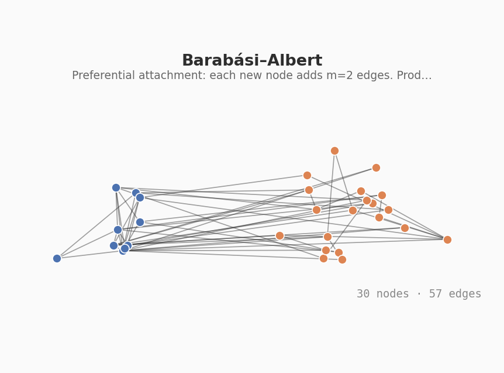<br/>
      <strong>4.1 Barabási–Albert</strong><br/>
      <sub>Preferential attachment: each new node adds m=2 edges. Produces power-law degree distribution.</sub>
    </td>
    <td align="center" valign="top" width="33%">
      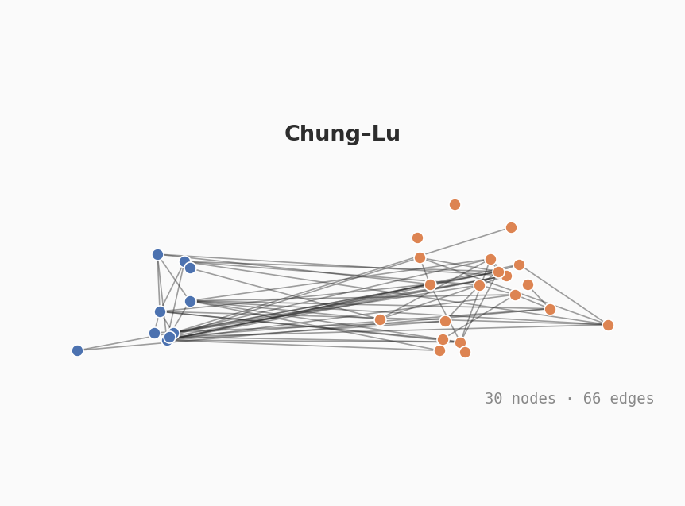<br/>
      <strong>4.2 Chung–Lu</strong><br/>
      <sub>Random graph with specified expected degree sequence.</sub>
    </td>
    <td align="center" valign="top" width="33%">
      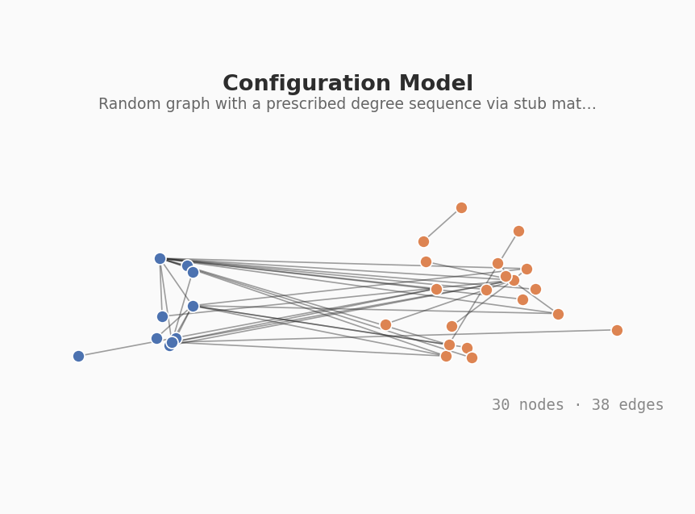<br/>
      <strong>4.3 Configuration Model</strong><br/>
      <sub>Random graph with a prescribed degree sequence via stub matching.</sub>
    </td>
  </tr>
  <tr>
    <td align="center" valign="top" width="33%">
      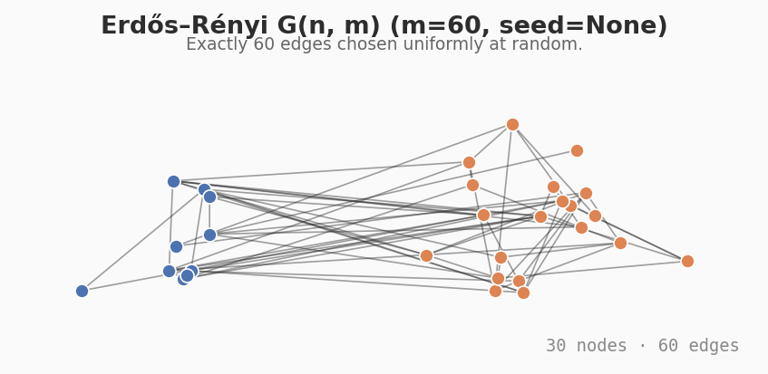<br/>
      <strong>4.4 Erdős–Rényi G(n, m)</strong><br/>
      <sub>Exactly 60 edges chosen uniformly at random.</sub>
    </td>
    <td align="center" valign="top" width="33%">
      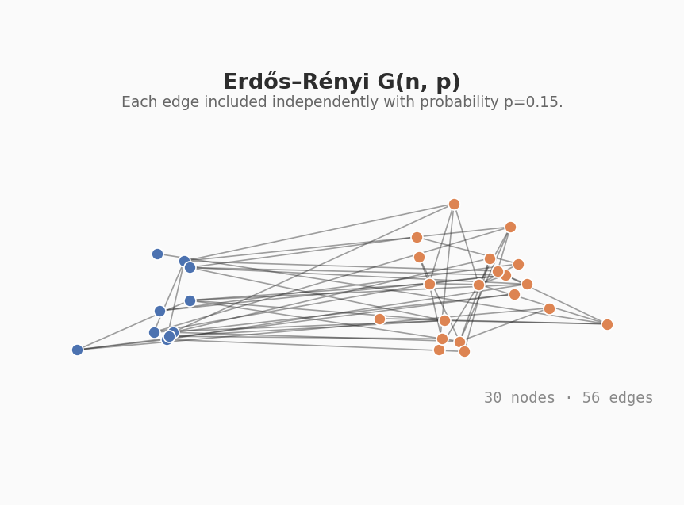<br/>
      <strong>4.5 Erdős–Rényi G(n, p)</strong><br/>
      <sub>Each edge included independently with probability p=0.15.</sub>
    </td>
    <td align="center" valign="top" width="33%">
      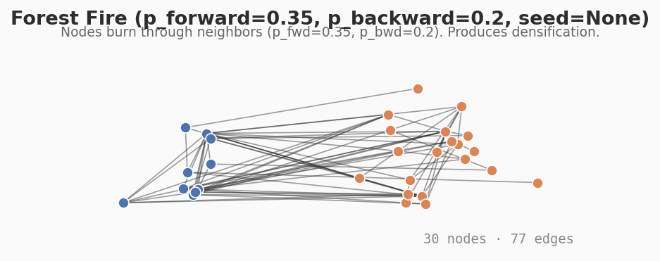<br/>
      <strong>4.6 Forest Fire</strong><br/>
      <sub>Nodes burn through neighbors (p_fwd=0.35, p_bwd=0.2). Produces densification.</sub>
    </td>
  </tr>
  <tr>
    <td align="center" valign="top" width="33%">
      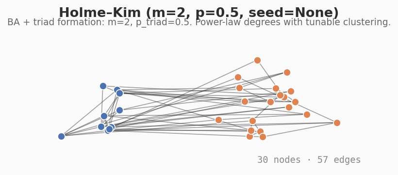<br/>
      <strong>4.7 Holme–Kim</strong><br/>
      <sub>BA + triad formation: m=2, p_triad=0.5. Power-law degrees with tunable clustering.</sub>
    </td>
    <td align="center" valign="top" width="33%">
      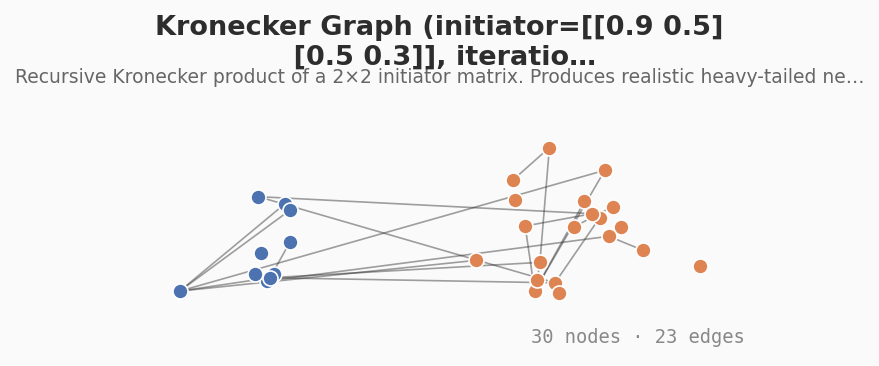<br/>
      <strong>4.8 Kronecker Graph</strong><br/>
      <sub>Recursive Kronecker product of a 2×2 initiator matrix. Produces realistic heavy-tailed networks.</sub>
    </td>
    <td align="center" valign="top" width="33%">
      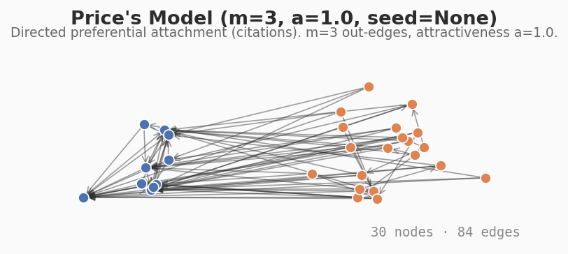<br/>
      <strong>4.9 Price's Model</strong><br/>
      <sub>Directed preferential attachment (citations). m=3 out-edges, attractiveness a=1.0.</sub>
    </td>
  </tr>
  <tr>
    <td align="center" valign="top" width="33%">
      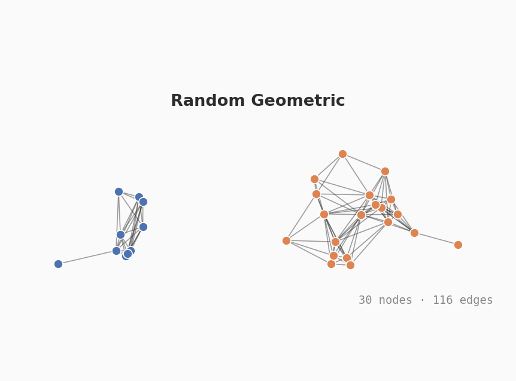<br/>
      <strong>4.10 Random Geometric</strong><br/>
      <sub>Connect nodes within Euclidean distance r=1.0.</sub>
    </td>
    <td align="center" valign="top" width="33%">
      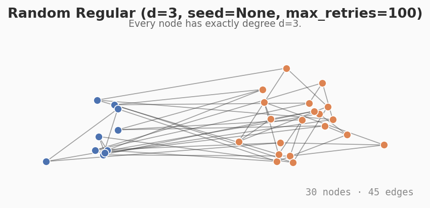<br/>
      <strong>4.11 Random Regular</strong><br/>
      <sub>Every node has exactly degree d=3.</sub>
    </td>
    <td align="center" valign="top" width="33%">
      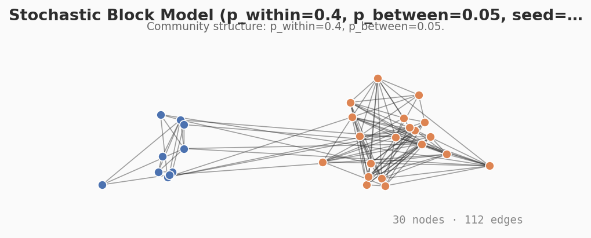<br/>
      <strong>4.12 Stochastic Block Model</strong><br/>
      <sub>Community structure: p_within=0.4, p_between=0.05.</sub>
    </td>
  </tr>
  <tr>
    <td align="center" valign="top" width="33%">
      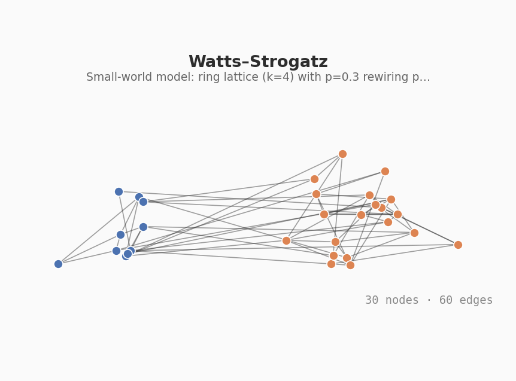<br/>
      <strong>4.13 Watts–Strogatz</strong><br/>
      <sub>Small-world model: ring lattice (k=4) with p=0.3 rewiring probability.</sub>
    </td>
    <td></td>
    <td></td>
  </tr>
</table>

---

### 5 · Geometric Spanners

Sparse subgraphs that approximately preserve shortest-path distances.

<table>
  <tr>
    <td align="center" valign="top" width="33%">
      <br/>
      <strong>5.1 Greedy Spanner</strong><br/>
      <sub>Greedy geometric spanner (t=2.0). Near-optimal sparsity among all t-spanners.</sub>
    </td>
    <td align="center" valign="top" width="33%">
      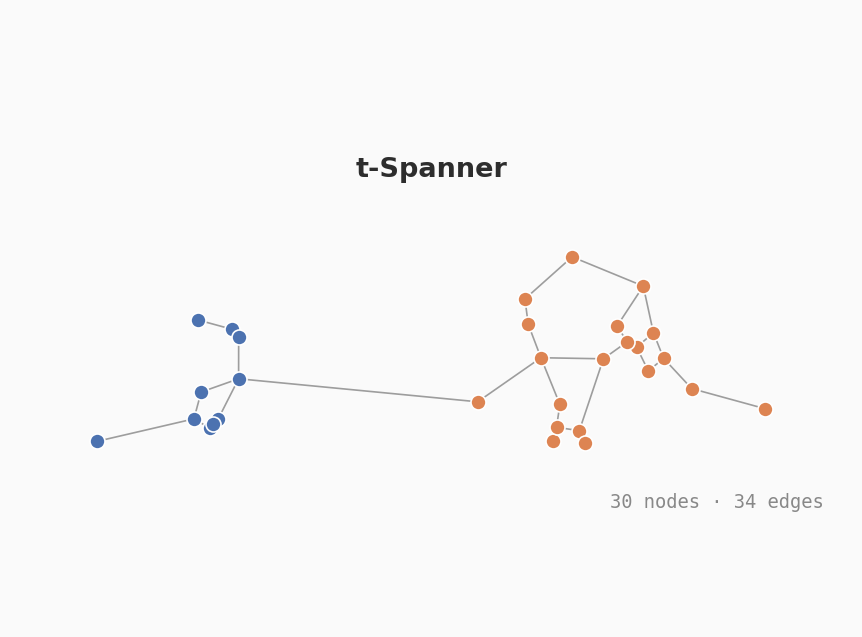<br/>
      <strong>5.2 t-Spanner</strong><br/>
      <sub>Sparse subgraph with stretch factor t=2.0. All-pairs greedy edge filtering.</sub>
    </td>
    <td align="center" valign="top" width="33%">
      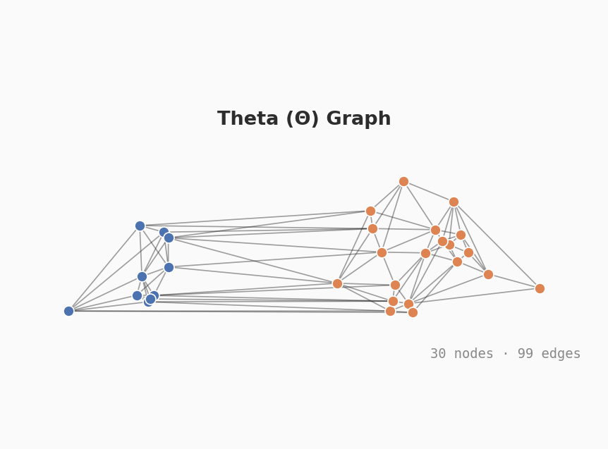<br/>
      <strong>5.3 Theta (Θ) Graph</strong><br/>
      <sub>Projection-based spanner with 6 cones. Stretch ≤ 2.73.</sub>
    </td>
  </tr>
  <tr>
    <td align="center" valign="top" width="33%">
      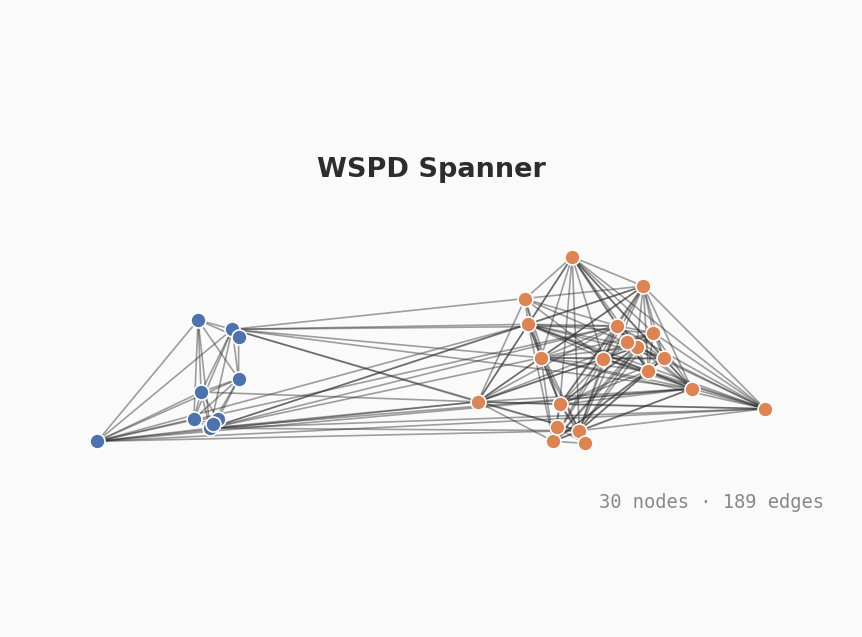<br/>
      <strong>5.4 WSPD Spanner</strong><br/>
      <sub>Well-Separated Pair Decomposition spanner (s=4.0). Theoretical stretch ≤ 3.00.</sub>
    </td>
    <td align="center" valign="top" width="33%">
      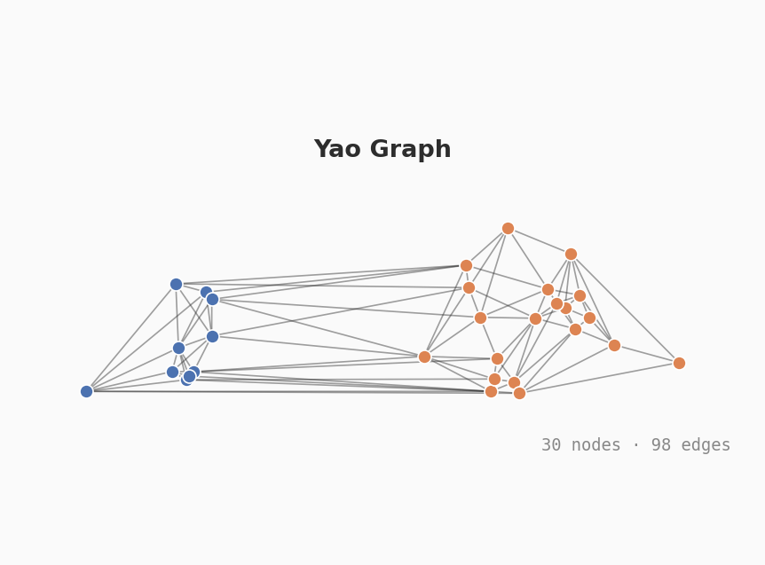<br/>
      <strong>5.5 Yao Graph</strong><br/>
      <sub>Nearest neighbor in each of 6 cones (θ=60°).</sub>
    </td>
    <td></td>
  </tr>
</table>

---

### 6 · Approximate Nearest Neighbor Graphs

Graphs optimized for efficient nearest neighbor search.

<table>
  <tr>
    <td align="center" valign="top" width="33%">
      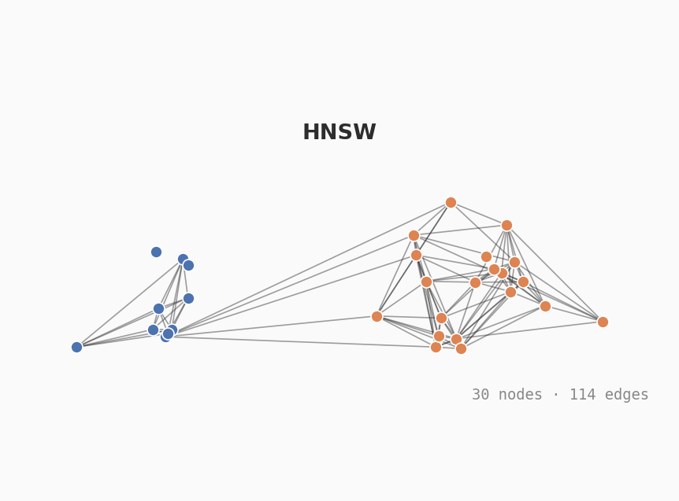<br/>
      <strong>6.1 HNSW</strong><br/>
      <sub>Hierarchical NSW: M=5, ef=32. Multi-layer skip-list-inspired ANN graph.</sub>
    </td>
    <td align="center" valign="top" width="33%">
      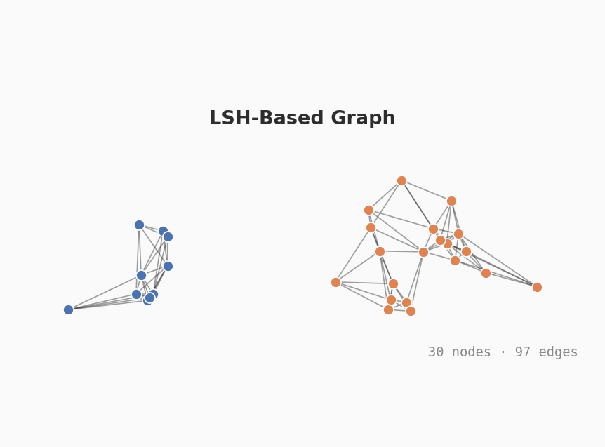<br/>
      <strong>6.2 LSH-Based Graph</strong><br/>
      <sub>k-NN via 10 hash tables × 8 bits. Random hyperplane LSH.</sub>
    </td>
    <td align="center" valign="top" width="33%">
      <br/>
      <strong>6.3 NN-Descent</strong><br/>
      <sub>Iterative k-NN refinement (k=5). 'Neighbor of neighbor is likely a neighbor.'</sub>
    </td>
  </tr>
  <tr>
    <td align="center" valign="top" width="33%">
      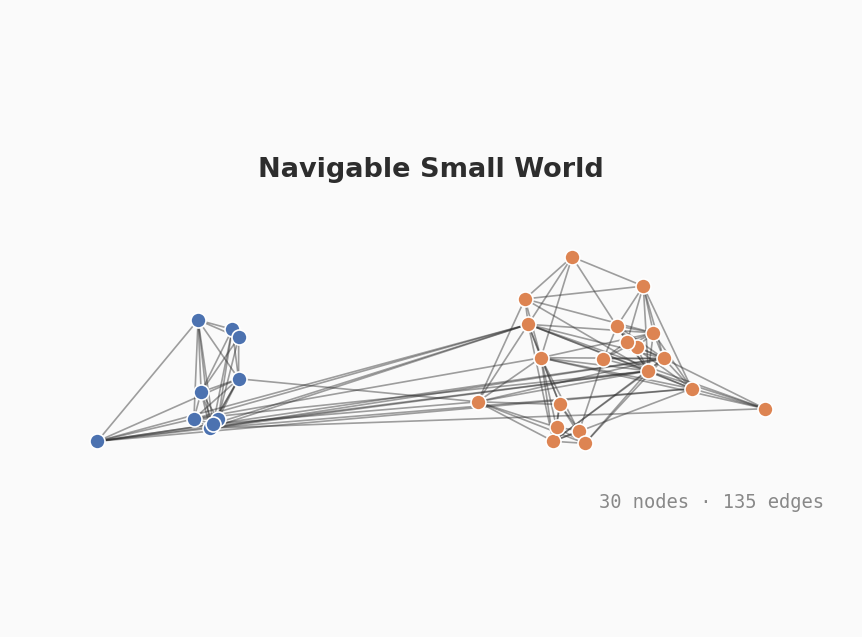<br/>
      <strong>6.4 Navigable Small World</strong><br/>
      <sub>Incremental insertion with greedy search. f=5 friends per node.</sub>
    </td>
    <td align="center" valign="top" width="33%">
      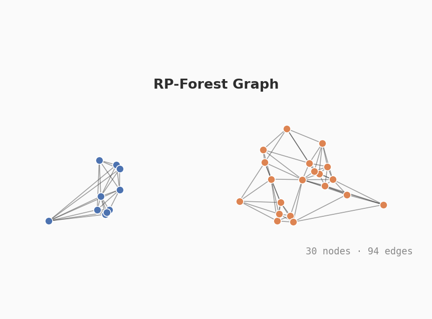<br/>
      <strong>6.5 RP-Forest Graph</strong><br/>
      <sub>k-NN via 10 random projection trees (leaf_size=5).</sub>
    </td>
    <td align="center" valign="top" width="33%">
      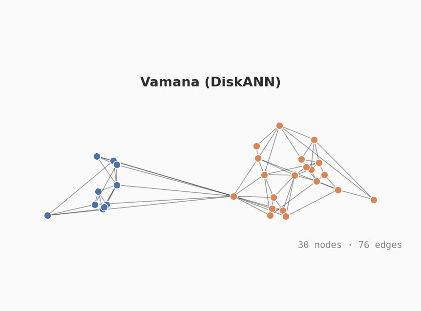<br/>
      <strong>6.6 Vamana (DiskANN)</strong><br/>
      <sub>Degree-bounded graph (R=5) with robust pruning (α=1.2). Medoid entry point.</sub>
    </td>
  </tr>
</table>

---

### 7 · Kernel & Similarity-Based Graphs

Graphs where edge weights come from kernel or similarity functions.

<table>
  <tr>
    <td align="center" valign="top" width="33%">
      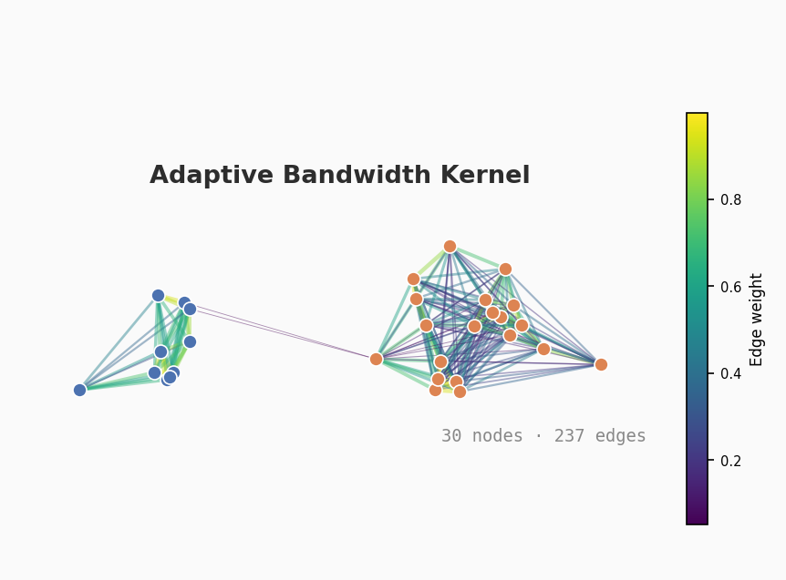<br/>
      <strong>7.1 Adaptive Bandwidth Kernel</strong><br/>
      <sub>Gaussian kernel with per-point σ from 7-th neighbor distance. Self-tuning for multi-scale data.</sub>
    </td>
    <td align="center" valign="top" width="33%">
      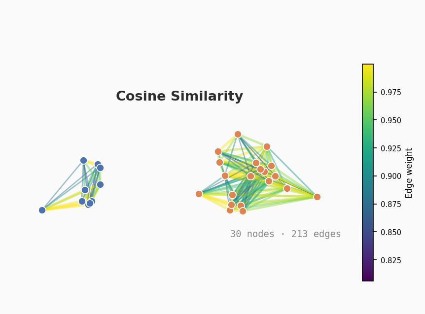<br/>
      <strong>7.2 Cosine Similarity</strong><br/>
      <sub>Connect pairs with cosine similarity > 0.8. Measures angular closeness.</sub>
    </td>
    <td align="center" valign="top" width="33%">
      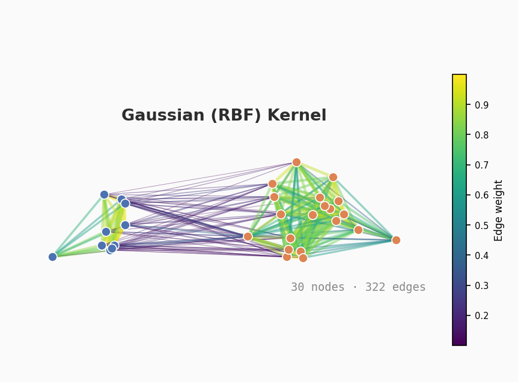<br/>
      <strong>7.3 Gaussian (RBF) Kernel</strong><br/>
      <sub>Edge weights from exp(-‖x-y‖²/2σ²). σ=median, threshold=0.1.</sub>
    </td>
  </tr>
  <tr>
    <td align="center" valign="top" width="33%">
      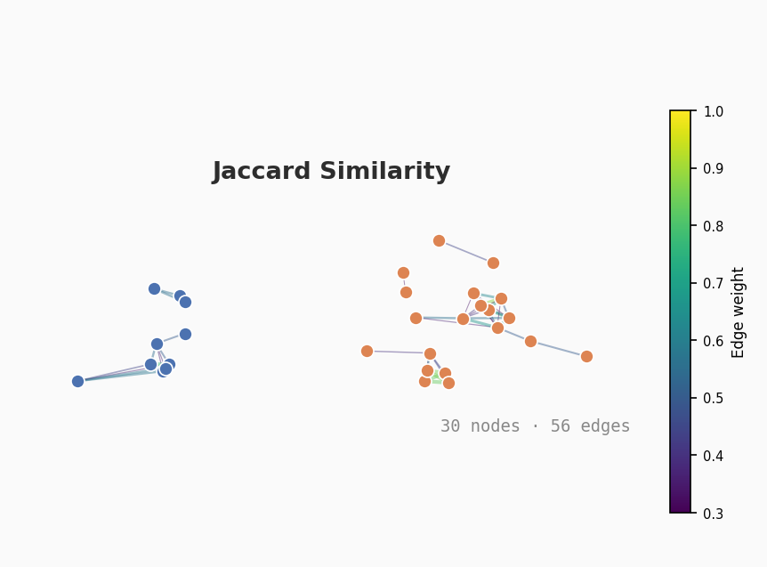<br/>
      <strong>7.4 Jaccard Similarity</strong><br/>
      <sub>Set-overlap similarity via spatial_bin features. J(A,B) = |A∩B|/|A∪B| ≥ 0.3.</sub>
    </td>
    <td align="center" valign="top" width="33%">
      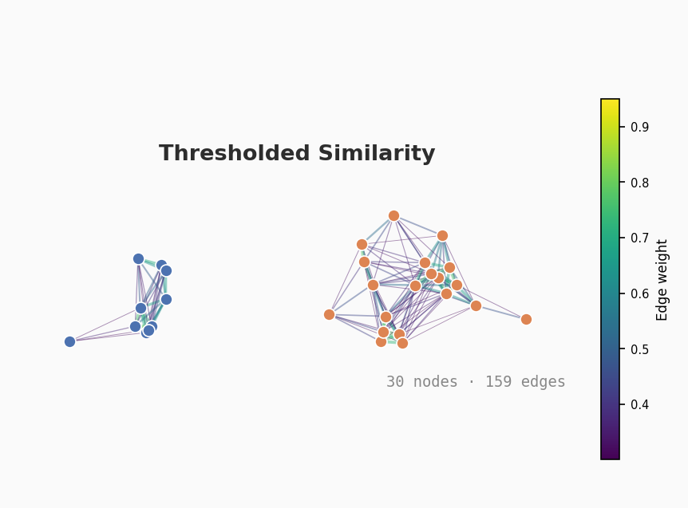<br/>
      <strong>7.5 Thresholded Similarity</strong><br/>
      <sub>Binarize laplacian similarity at threshold=0.3.</sub>
    </td>
    <td></td>
  </tr>
</table>

---

### 8 · Visibility Graphs

Graphs derived from geometric visibility or time series.

*For time-series visibility, we sort points by x-coordinate and treat y as the series value.*

<table>
  <tr>
    <td align="center" valign="top" width="33%">
      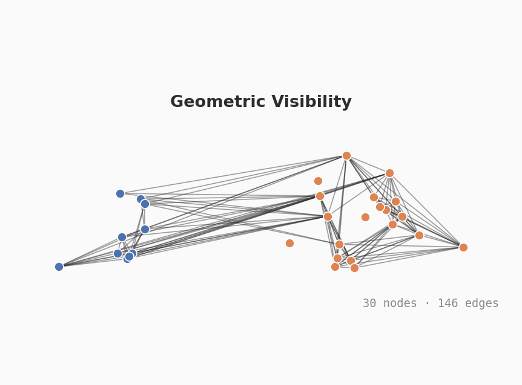<br/>
      <strong>8.1 Geometric Visibility</strong><br/>
      <sub>Connect points with unobstructed line-of-sight. Used for shortest-path planning with obstacles.</sub>
    </td>
    <td align="center" valign="top" width="33%">
      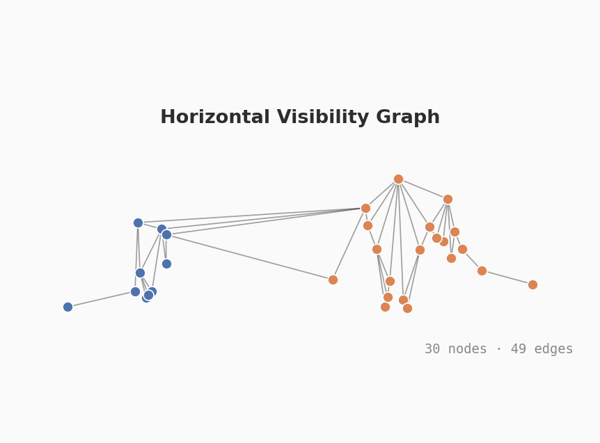<br/>
      <strong>8.2 Horizontal Visibility Graph</strong><br/>
      <sub>Simplified visibility: intermediate points must lie below min(y_i, y_j). Always a subgraph of the NVG.</sub>
    </td>
    <td align="center" valign="top" width="33%">
      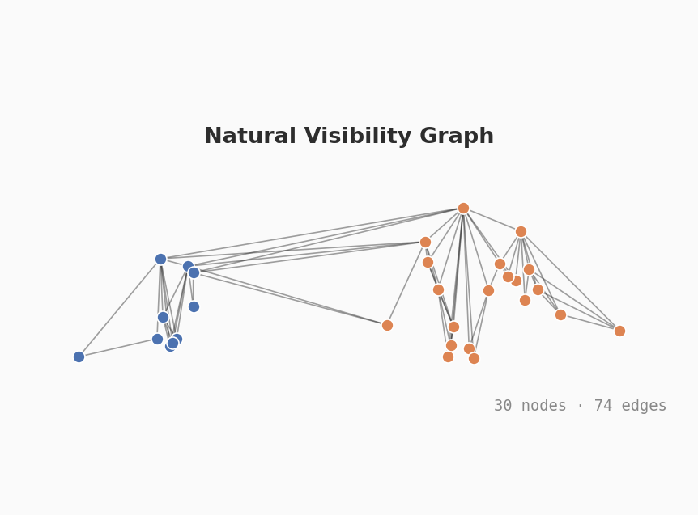<br/>
      <strong>8.3 Natural Visibility Graph</strong><br/>
      <sub>Time series → graph: connect points with unobstructed line-of-sight over intermediate values.</sub>
    </td>
  </tr>
</table>

---

### 9 · Data-Driven / Learned Graphs

Graphs inferred from statistical relationships between features.

*Each point's (x, y) coordinates generate spatially correlated multivariate observations.*

<table>
  <tr>
    <td align="center" valign="top" width="33%">
      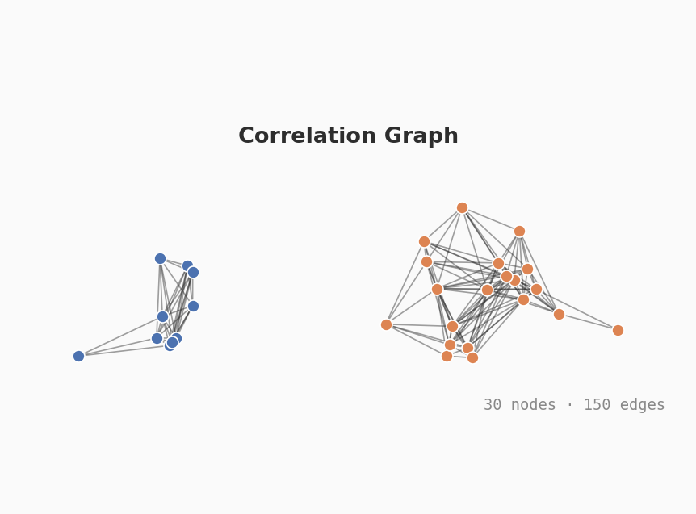<br/>
      <strong>9.1 Correlation Graph</strong><br/>
      <sub>Connect variables with Pearson |ρ| ≥ 0.5. From 500 synthetic observations.</sub>
    </td>
    <td align="center" valign="top" width="33%">
      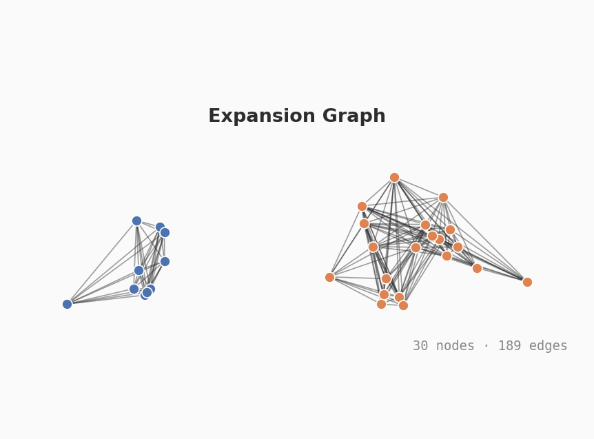<br/>
      <strong>9.2 Expansion Graph</strong><br/>
      <sub>Diffusion affinity graph: 3-step random walk on initial k-NN.</sub>
    </td>
    <td align="center" valign="top" width="33%">
      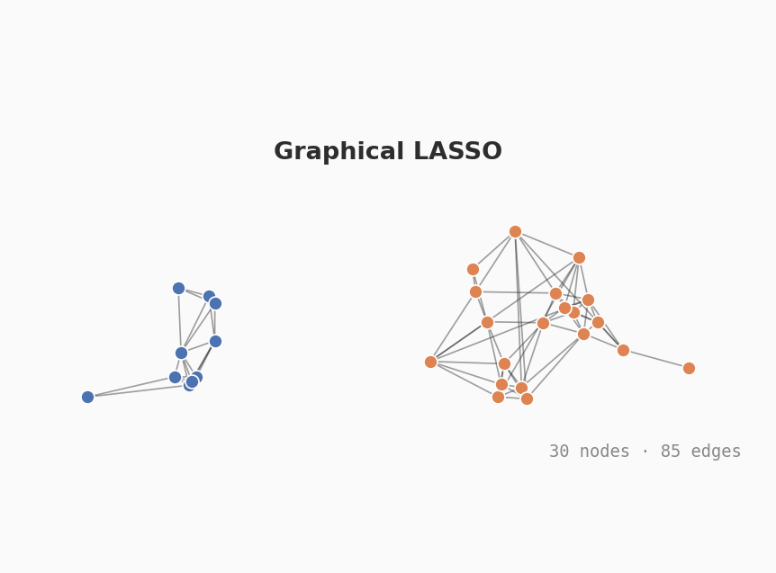<br/>
      <strong>9.3 Graphical LASSO</strong><br/>
      <sub>Sparse inverse covariance estimation (α=0.1). L1 penalty auto-selects graph structure.</sub>
    </td>
  </tr>
  <tr>
    <td align="center" valign="top" width="33%">
      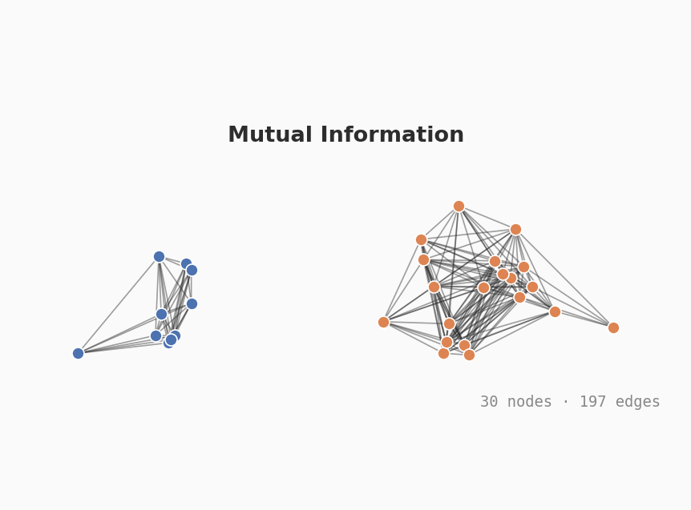<br/>
      <strong>9.4 Mutual Information</strong><br/>
      <sub>MI-based edges (ksg estimator). Detects all dependencies, not just linear.</sub>
    </td>
    <td align="center" valign="top" width="33%">
      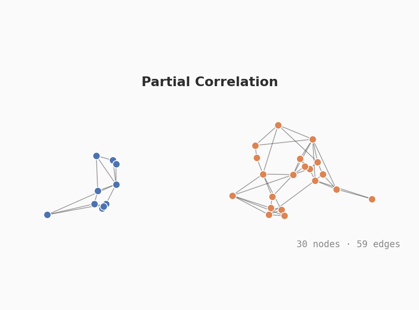<br/>
      <strong>9.5 Partial Correlation</strong><br/>
      <sub>Gaussian graphical model: direct linear relationships via precision matrix. |ρ_partial| ≥ 0.15.</sub>
    </td>
    <td></td>
  </tr>
</table>

---

### 10 · Miscellaneous

Other notable graph construction methods.

<table>
  <tr>
    <td align="center" valign="top" width="33%">
      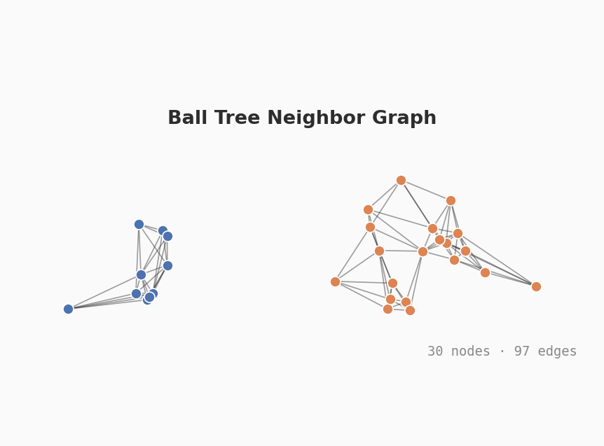<br/>
      <strong>10.1 Ball Tree Neighbor Graph</strong><br/>
      <sub>k-NN (k=5) via ball tree. Handles arbitrary metrics and higher dimensions.</sub>
    </td>
    <td align="center" valign="top" width="33%">
      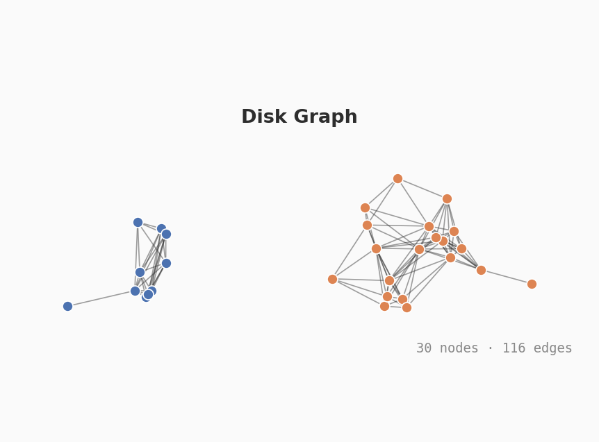<br/>
      <strong>10.2 Disk Graph</strong><br/>
      <sub>Unit disk model: connect if distance ≤ 1.00 (radius r=0.5).</sub>
    </td>
    <td align="center" valign="top" width="33%">
      <br/>
      <strong>10.3 Intersection Graph</strong><br/>
      <sub>Connect nodes whose circles overlap. Mean radius=0.7.</sub>
    </td>
  </tr>
  <tr>
    <td align="center" valign="top" width="33%">
      <br/>
      <strong>10.4 KD-Tree Neighbor Graph</strong><br/>
      <sub>k-NN (k=5) via KD-tree. Same result as brute-force but O(n log n) construction.</sub>
    </td>
    <td></td>
    <td></td>
  </tr>
</table>

---

<!-- GALLERY_END -->

## API Usage

Every algorithm follows a consistent interface:

```python
from graphgallery.points import make_two_cluster_layout
from graphgallery.proximity import SymmetricKNNGraph
from graphgallery.viz import plot_graph

# Generate the canonical 30-point layout
points = make_two_cluster_layout(seed=42)

# Build a symmetric k-NN graph (undirected union)
builder = SymmetricKNNGraph(k=5)
G = builder.build(points)

# Visualize
fig = plot_graph(G, points, title="k-NN Graph (k=5)")
fig.savefig("knn_example.png", dpi=150)
```

All builders inherit from `GraphBuilder` and implement:

```python
class GraphBuilder(ABC):
    @abstractmethod
    def build(self, points: np.ndarray) -> nx.Graph:
        """Build a graph from an (n, d) array of points."""
        ...

    @property
    @abstractmethod
    def name(self) -> str:
        """Human-readable algorithm name."""
        ...

    @property
    @abstractmethod
    def category(self) -> str:
        """Category slug (e.g., 'proximity', 'spanning')."""
        ...
```

### Batch Generation

```bash
# Generate all 58 graphs and save images
python scripts/generate_all_examples.py

# Generate only a specific category
python scripts/generate_all_examples.py --category proximity

# Generate a single algorithm
python scripts/generate_all_examples.py --algorithm knn --k 5
```

---

## Project Structure

```
graphgallery/          Core library — one subpackage per category
├── points.py          Canonical point layout generator
├── viz.py             Shared matplotlib visualization
├── base.py            Abstract GraphBuilder base class
├── proximity/          9 algorithms
├── triangulation/      2 algorithms
├── spanning/           6 algorithms
├── random_models/     13 algorithms
├── spanners/           5 algorithms
├── ann/                6 algorithms
├── kernel/             5 algorithms
├── visibility/         3 algorithms
├── data_driven/        5 algorithms
└── misc/               4 algorithms

scripts/               CLI tools for generation
tests/                 pytest test suite
assets/                Generated images and banner
```

---

## Testing

```bash
# Run all tests
pytest tests/ -v

# Run tests for a specific category
pytest tests/test_proximity.py -v

# Run with coverage
pytest tests/ --cov=graphgallery --cov-report=html
```

---

## Contributing

Contributions are welcome! To add a new graph algorithm:

1. **Fork** the repo and create a feature branch
2. **Add** your builder in the appropriate `graphgallery/<category>/` subpackage
3. **Inherit** from `GraphBuilder` and implement `build()`, `name`, and `category`
4. **Add tests** in `tests/test_<category>.py`
5. **Run** `python scripts/generate_all_examples.py --algorithm your_algo` to generate the image
6. **Submit** a PR with the new code, test, and image

---

## License

MIT License — see [LICENSE](LICENSE) for details.